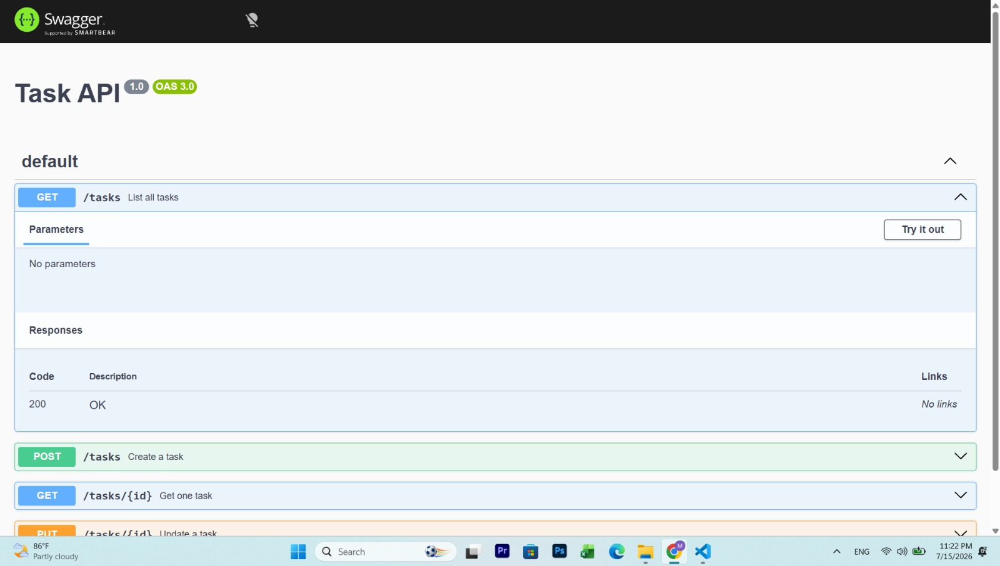
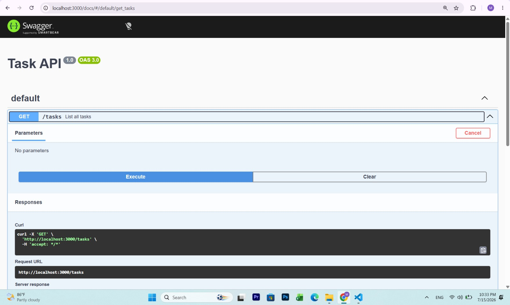

# BE-01: Task CRUD API

A minimal Express API for managing a to-do list, with full CRUD (Create,
Read, Update, Delete) on an in-memory list, interactive documentation via
Swagger UI, and proper HTTP status codes throughout.

## How to run

```bash
npm install
node server.js
```

Server starts on `http://localhost:3000`.

## Endpoints

| Method | Path         | Description                  | Success | Errors                       |
|--------|--------------|-------------------------------|---------|-------------------------------|
| GET    | `/`          | API info                      | 200     | -                             |
| GET    | `/health`    | Health check                   | 200     | -                             |
| GET    | `/tasks`     | List all tasks                 | 200     | -                             |
| GET    | `/tasks/:id` | Get one task                   | 200     | 404 if not found              |
| POST   | `/tasks`     | Create a task                   | 201     | 400 if title missing          |
| PUT    | `/tasks/:id` | Update a task's title/done      | 200     | 400 invalid · 404 not found   |
| DELETE | `/tasks/:id` | Delete a task                    | 204     | 404 if not found              |

## Example request

```bash
curl -i -X POST http://localhost:3000/tasks -H "Content-Type: application/json" -d "{}"
```

```
HTTP/1.1 400 Bad Request
X-Powered-By: Express
Content-Type: application/json; charset=utf-8
Content-Length: 29
ETag: W/"1d-53lIJ95lGl3GPLg/Tko6BPJr+/c"
Date: Wed, 15 Jul 2026 17:25:31 GMT
Connection: keep-alive
Keep-Alive: timeout=5

{"error":"Title is required"}
```

## Swagger UI

Interactive docs are available at `http://localhost:3000/docs` once the
server is running. Every endpoint can be tried directly from the browser
via "Try it out".

Swagger UI






## Data storage

Tasks are kept in memory (a plain array in `server.js`) — no database,
no files. This is intentional for this stage of the assignment: restarting
the server resets the task list back to the 3 seeded example tasks.

### The mortality experiment

Creating a few tasks and then restarting the server (`Ctrl+C`, then
`node server.js` again) wipes out everything that was added — `GET /tasks`
comes back with only the original 3 seed tasks. This happens because the
task list lives only in the Node process's memory; when the process ends,
that memory is freed and nothing was ever written to disk. This is exactly
the gap that a real database (added in a later task) is meant to close.
