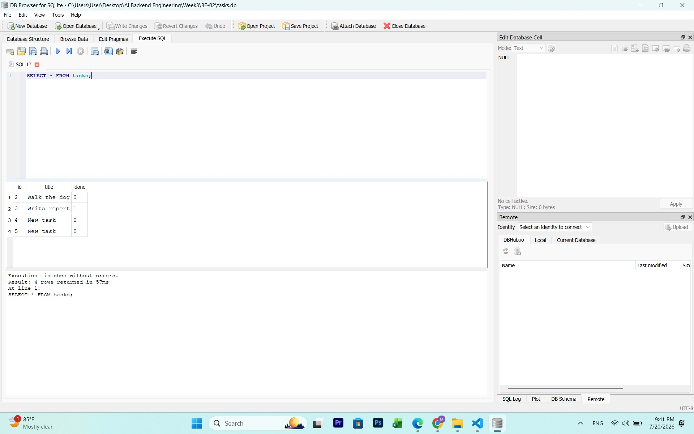
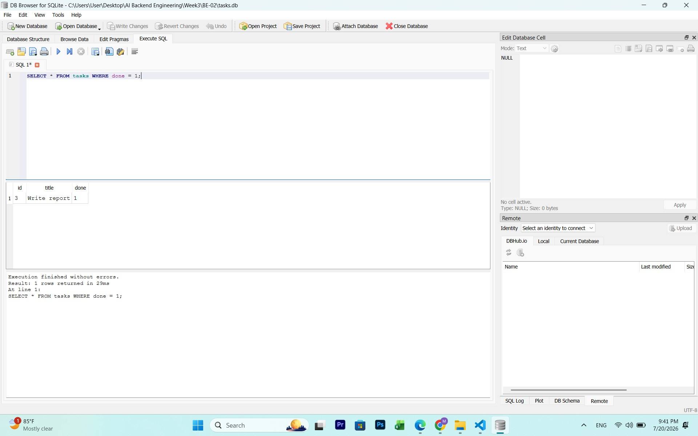
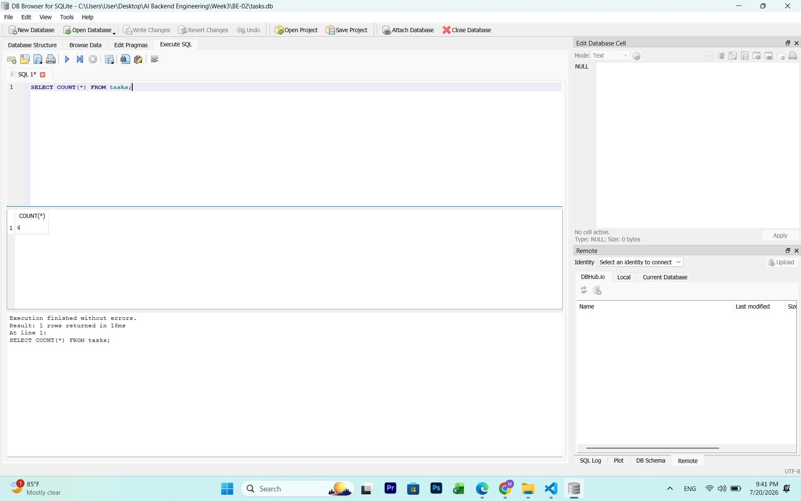

BE-02: Task API with SQLite

This project takes the CRUD API I built in BE-01 and replaces the in memory task list with a real SQLite database. The endpoints, request bodies, and responses are all the same as before. The only thing that changed is where the data actually lives, so now the tasks survive a server restart instead of disappearing.

Why SQLite

SQLite doesn't need a separate server running in the background like Postgres does. It just stores everything in a single file on disk, and that file gets created automatically the first time the app runs. For a small project like this where I just need persistence without setting up Docker or a database server, it was the simplest option that still uses real SQL.

Where the database file is

The database is stored in a file called tasks.db in the project root. It's created automatically the first time you run the server, along with the tasks table, and it gets seeded with 3 example tasks only if the table is empty.

How to run it
npm install
node server.js

The server starts on http://localhost:3000. The first time you run it, tasks.db will be created in the same folder along with the seeded tasks. On every run after that, the existing data is used as is.

Endpoints

GET / returns basic info about the API

GET /health is a simple health check

GET /tasks returns every task in the database

GET /tasks/:id returns a single task, or a 404 if that id doesn't exist

POST /tasks creates a new task, requires a title in the body, returns 400 if title is missing or empty

PUT /tasks/:id updates a task's title and or done status, returns 404 for an unknown id

DELETE /tasks/:id deletes a task and returns 204, or 404 if it doesn't exist

Swagger docs are available at http://localhost:3000/docs

Proving persistence

I created a task, restarted the server, and ran GET /tasks again. The task was still there. This is the main difference from BE-01, where restarting the server would reset everything back to the 3 seed tasks because the data only lived in a JavaScript array in memory.

Exploring the database directly

I opened tasks.db in DB Browser for SQLite and ran a few queries manually to see the data outside of the API.

sql
SELECT * FROM tasks;

This returned all the tasks currently stored, matching exactly what GET /tasks returns through the API. A screenshot of this is included below.

 

What I noticed

Once the database layer was swapped in, nothing about how the API is used had to change. Same URLs, same request bodies, same responses. The only thing that changed under the hood was how the data gets stored and read. That separation between the API and the database is basically the whole point of this assignment, and it makes sense now why switching databases later (say from SQLite to Postgres) wouldn't require touching the routes at all.