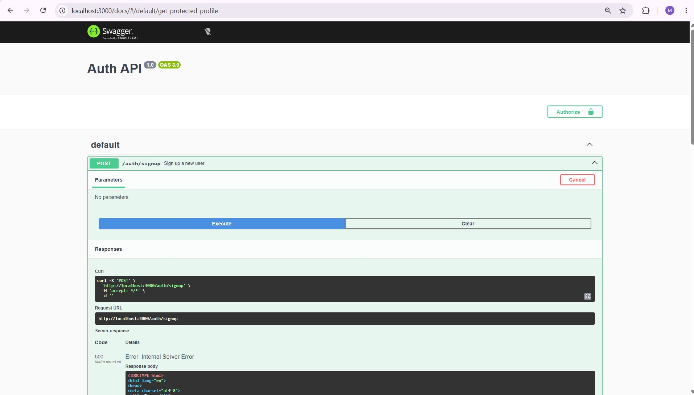

# BE-03: Auth API with Supabase

A small Express API that handles user signup, login, and logout using Supabase as the identity provider, and protects certain routes so they only work with a valid access token.

## What this is

Up until this task, every endpoint I built was completely open, anyone could hit any route. This project adds real authentication on top of that. Supabase handles the actual account creation, password checking, and token issuing, and my server's job is to verify the token that gets sent back on each request before allowing access to protected routes.

## Setting up environment variables

Create a `.env` file in the project root with the following:

```
SUPABASE_URL=your_project_url
SUPABASE_KEY=your_anon_key
PORT=3000
```

You can get your own project URL and anon key from your Supabase dashboard under Project Settings, API. A `.env.example` file with the same structure (but no real values) is included as a template. The real `.env` file is never committed, it's listed in `.gitignore`.

## How to run

```bash
npm install
node server.js
```

The server starts on `http://localhost:3000` and logs a message confirming it connected to Supabase.

## Endpoints

| Method | Path                  | Auth required | Description                          |
|--------|-----------------------|----------------|----------------------------------------|
| POST   | /auth/signup          | No             | Creates a new user account              |
| POST   | /auth/login           | No             | Logs in and returns an access token      |
| POST   | /auth/logout          | Yes            | Ends the session for the given token     |
| GET    | /public/info          | No             | Returns public info, no token needed     |
| GET    | /protected/profile    | Yes            | Returns the logged in user's profile     |
| GET    | /protected/dashboard  | Yes            | A second protected route, same middleware |

Auth required routes expect the token in the header as `Authorization: Bearer <token>`.

## How the token verification works

Signup and login are handled directly by Supabase's SDK, `supabase.auth.signUp()` and `supabase.auth.signInWithPassword()`. Login returns a JWT access token.

For protected routes, I wrote a single reusable middleware function called `requireAuth`. It pulls the token out of the Authorization header, checks that it exists and is in the right format, then calls `supabase.auth.getUser(token)` to confirm with Supabase that the token is real and not expired. If it passes, the request continues to the actual route handler. If it fails, the middleware itself returns a 401 and the route logic never runs. Both `/protected/profile` and `/protected/dashboard` just plug this same middleware in, instead of repeating the token check in every route.

## Status codes used

201 on successful signup, 200 on successful login or a successful protected read, 204 on logout, 400 when email or password is missing, 401 when a token is missing, malformed, or invalid/expired.

## Swagger UI

Docs are available at `http://localhost:3000/docs`. Protected routes are marked with a lock icon. Clicking "Authorize" and pasting a valid access token lets you test the protected endpoints directly from the browser using "Try it out".



## A note on testing

I tested this by signing up with a real email (Supabase rejects obviously fake domains like example.com), logging in to get a token, then hitting the protected routes with that token in the Authorization header. Changing even one character in the token correctly returned a 401. I also temporarily disabled "Confirm email" in the Supabase dashboard while testing locally, so new signups could log in immediately without waiting on a confirmation email.

## Lessons learned

Keeping token verification in a single middleware function made it trivial to add a second protected route (`/protected/dashboard`) without duplicating any auth logic.